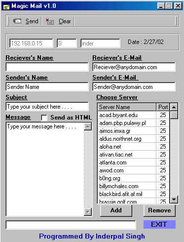



## MagicMail

### Description

MagicMail is an simple anonymous mailer. Using MagicMail you can send email without logging into your account. It also supports sending email in HTML format. I have used the Winsock control in VB. You can easily understand the program . Thank you. Please vote for this program and have a look at it as well. please vote for me and a big thank you to all those whom have tried it and visited this program.
 
### More Info
 

             |
---                |---
**Submitted On**   |2002-02-27 01:57:20
**By**             |[inderpal](https://github.com/Planet-Source-Code/PSCIndex/blob/master/ByAuthor/inderpal.md)
**Level**          |Intermediate
**User Rating**    |5.0 (30 globes from 6 users)
**Compatibility**  |VB 5\.0, VB 6\.0
**Category**       |[Complete Applications](https://github.com/Planet-Source-Code/PSCIndex/blob/master/ByCategory/complete-applications__1-27.md)
**World**          |[Visual Basic](https://github.com/Planet-Source-Code/PSCIndex/blob/master/ByWorld/visual-basic.md)
**Archive File**   |[MagicMail579072262002\.zip](https://github.com/Planet-Source-Code/inderpal-magicmail__1-32137/archive/master.zip)

